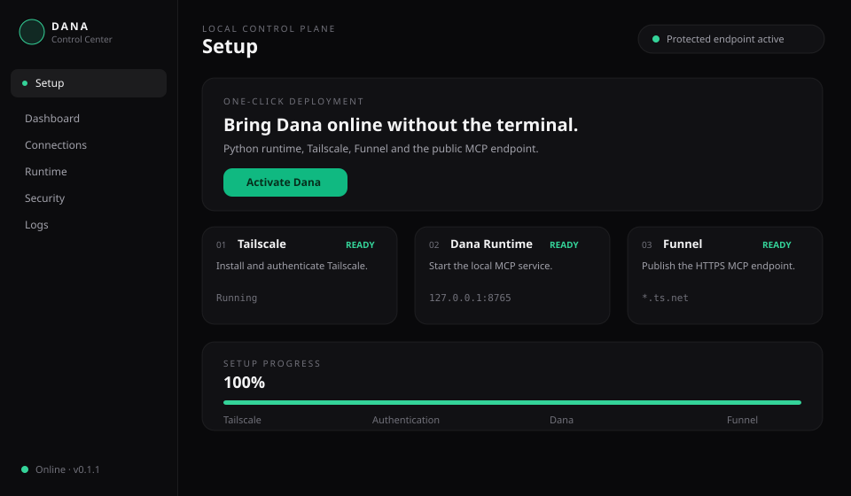
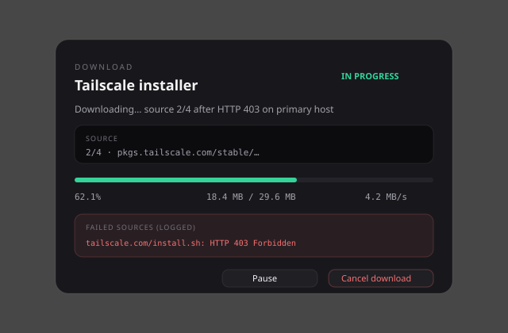
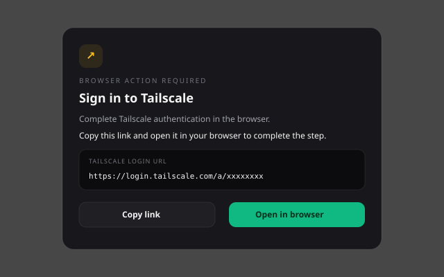

# Dana MCP Server

> Turn AI chatbots into powerful, free agents that can work with your computer, code, files, projects, and development environment through MCP.

🇮🇷 **Persian documentation:** [README_FA.md](README_FA.md)  
🇬🇧 **English:** This document

---

## 🙏 Special Thanks

Special thanks to **Mohsen Samadinejad**. The original execution idea and early architectural direction that inspired this project came from his work.

His **PHP MCP Server** was an important behavioral reference during Dana's Python implementation and evolution.

GitHub: [Mohsen Samadinejad](https://github.com/samadinejad)

---

## What is Dana?

Dana is a cross-platform Python MCP server that gives compatible AI chatbots real capabilities on the machine where Dana runs.

Instead of being limited to conversation, a chatbot can become an agent that can:

- read, create, edit, and organize files
- inspect and modify codebases
- run tests, builds, linters, and diagnostics
- manage Git, processes, packages, Docker, databases, and APIs
- automate browsers
- analyze projects and architecture
- work with persistent project memory and optimized context
- extract and analyze PDF content
- generate documents, reports, README files, Word files, and PDFs
- plan, review, debug, and validate engineering work

Dana is designed to work with MCP-compatible AI clients such as ChatGPT, Claude, Grok, and other compatible clients. The core project is free and self-hosted: Dana runs on your own computer or server and performs work there.

## Why Dana?

Dana is built around three goals:

1. **Real agent capabilities** — the chatbot can act through tools instead of only generating text.
2. **Self-hosting and control** — tools run on infrastructure you control.
3. **Efficiency** — Progressive Tool Discovery, caching, compact results, batching, and context intelligence reduce unnecessary latency and token usage.

---


# Installation and Connection

## Download Dana Desktop

For most users, **Dana Desktop is the recommended method**. Download the latest installer for Windows, Linux, or macOS from the project's GitHub Releases page:

- [Download the latest Dana Desktop release](https://github.com/seyed-ali-002/Dana-MCP-Server/releases/latest)
- [All Dana releases](https://github.com/seyed-ali-002/Dana-MCP-Server/releases)

The desktop application bundles the Dana setup runtime and provides graphical control for Tailscale, Funnel, connections, runtime, security, and logs.

## Method 1 — Dana Desktop (recommended)

After installing Dana Desktop, open **Setup** and use **Install & Activate** / **Activate Dana**.



### Guided setup flow

1. **Install Tailscale**  
   Dana downloads the official installer (or a static binary). If a host returns **HTTP 403** or another error, it automatically tries mirrors and fallbacks. Every attempt is written to **Logs**.

2. **Download progress**  
   A progress window shows percent complete, speed, current source, and failed sources. You can **Pause**, **Resume**, or **Cancel** the download.



3. **Tailscale login**  
   After install, Dana shows the Tailscale login URL in the same Control Center window. Use **Copy link** and open it in your browser (or **Open in browser**). Keep Dana open until authentication finishes — setup continues automatically.



4. **Start Dana runtime**  
   The local MCP service is started on `127.0.0.1:8765`.

5. **Enable Funnel**  
   When asked, confirm public exposure. If Tailscale needs Funnel approval, the approval URL appears in the same window with **Copy link** / **Open in browser**. After approval, Funnel is activated on the canonical HTTPS route.

### Other panels

| Panel | Purpose |
|---|---|
| **Dashboard** | Dana / Tailscale / Funnel status |
| **Connections** | Copy local & public tokenized MCP URLs; run handshake test |
| **Runtime** | Start / stop Dana |
| **Security** | View, apply, or revoke the auth token |
| **Configuration** | Environment and path policy |
| **Logs** | Setup, download, auth, Funnel, and runtime events |

Local URL format:
```text
http://127.0.0.1:8765/<TOKEN>/mcp
```

Public Funnel URL format:
```text
https://<machine>.<tailnet>.ts.net/<TOKEN>/mcp
```

After the first installation, the Setup panel uses **Activate Dana** for normal activation instead of asking you to repeat installation.

When Dana Desktop closes, it stops the Dana runtime. The Tailscale Funnel route is intentionally left untouched so other sessions and routes are not disrupted.

### Download fallbacks

If the primary Tailscale download is blocked (for example **403 Forbidden**), Dana tries, in order:

- optional `DANA_TAILSCALE_MIRROR` / `DANA_TAILSCALE_PROXY`
- official `tailscale.com` / `pkgs.tailscale.com`
- GitHub / mirror static packages
- jsDelivr copy of the installer script (where applicable)

All failures are logged in the **Logs** panel. If every source fails, Setup shows a clear error and a manual download URL.

## Method 2 — Terminal / CLI

Use this method when you prefer a terminal or are working on a server.

### Docker runtime

Clone the project and install the CLI:

```bash
git clone https://github.com/seyed-ali-002/Dana-MCP-Server.git
cd Dana-MCP-Server
python3 -m pip install -e .
```

Windows:
```powershell
py -3 -m pip install -e .
```

Start Dana:
```bash
dana run
```

Useful commands:
```bash
dana start
dana stop
dana restart
dana status
dana logs
dana update
dana uninstall
```

`dana run`, `dana up`, and `dana start-all` prepare the runtime and networking flow. `dana run`, `dana install`, and `dana connect` use Docker when Docker is available and fall back to the native runtime otherwise; once Dana is installed, the lifecycle commands (`start`, `stop`, `restart`, `status`, `logs`) prefer the native runtime. To force serving through Docker, set `DANA_RUNTIME_BACKEND=docker`.

### Tailscale Funnel

For Local Mode, Funnel publishes Dana through HTTPS:

```bash
tailscale status
tailscale funnel --https=443 --yes --bg 8765
tailscale funnel status
```

The connection URL must include Dana's authentication token:

```text
https://<machine>.<tailnet>.ts.net/<TOKEN>/mcp
```

For local-only access:
```text
http://127.0.0.1:8765/<TOKEN>/mcp
```

Use `dana doctor --show-url` when you need the complete tokenized URL in a trusted terminal.

### Native runtime

If Docker is unavailable, use the native installer:

Linux/macOS:
```bash
python3 install.py
```

Windows:
```powershell
py -3 install.py
```

The native installer configures the runtime, authentication, workers, and deployment mode.

## Deployment methods

### Local Mode

Local Mode is intended for a personal computer. Dana listens locally and Tailscale Funnel provides the public HTTPS boundary.

```text
AI Client → Tailscale Funnel → Dana → Local machine
```

### Server Mode

Server Mode is intended for a VPS or dedicated server. Dana listens on localhost behind a reverse proxy such as Nginx, Caddy, or Apache.

```text
Internet → Reverse Proxy → 127.0.0.1:<DANA_PORT> → Dana
```

Server Mode can use the canonical `/mcp` endpoint with OAuth 2.0 + PKCE. Local Mode uses the tokenized compatibility URL.

## Connect an AI client

Use the exact connection URL shown by Dana Desktop under **Connections**, or the tokenized URL printed by the CLI.

For ChatGPT, Claude, Grok, and other MCP-compatible clients, follow the current custom MCP/connector flow provided by that client. Client menus and availability can change over time.

**Important:** A tokenized connection URL is a credential. Do not publish it in screenshots, issues, logs, or public documentation.

---

# Security and Access Control

Dana executes tools on the machine where it is running. Operating-system permissions therefore matter.

Filesystem access can be restricted in `config/access_policy.json`:

```json
{
  "allowed_paths": ["/home/user/projects", "/mnt/workspace"],
  "deny_paths": []
}
```

Dana also provides MCP tools for inspecting and updating the access policy.

Keep connection URLs and tokens private. Rotate a token when necessary:

```bash
python3 scripts/regenerate_token.py
```

---

# Concurrent Workers and Agent Orchestration


Dana supports multiple AI clients and concurrent tool execution in the same MCP service. Worker slots are bounded by `DANA_WORKERS`, while MCP sessions remain in the stateful transport process so session state is not lost by creating a separate HTTP server for every worker.

Each request is assigned to a worker slot, and independent work can run concurrently. The runtime also supports dependency-aware plans through `dana_plan_execute`: independent tasks can execute in parallel while dependent tasks wait for their prerequisites.

Useful runtime tools include:

- `dana_worker_status` — live worker capacity and active/idle slots
- `dana_parallel_call` — concurrent execution of independent tool calls
- `dana_plan_execute` — dependency-aware task DAG execution
- `dana_runtime_health` — registry and orchestration health checks
- `dana_workspace_context` — compact project/workspace context

This architecture is intended for multiple simultaneous chats without serializing all tool calls behind Worker #1.

# Performance and Context Optimization

Dana is intentionally designed to avoid turning a large tool registry into unnecessary prompt overhead.

## Progressive Tool Discovery


By default, the MCP client sees a small set of entry points:

- `dana_search_tools`
- `dana_list_tools`
- `dana_help_tool`
- `dana_call_tool`
- `dana_batch_call`
- `dana_capabilities`
- `dana_worker_status`
- `dana_runtime_health`
- `dana_optimization_stats`

The complete registry remains available internally and is discovered on demand. This keeps initial MCP context small even when Dana contains many capabilities.

## Runtime Optimization

Dana includes:

- short-lived caching for safe read operations
- parallel execution for independent batch calls
- compact result generation
- context deduplication and compression
- repository and symbol indexing
- delta context and file summaries
- persistent codebase memory
- bounded analysis to avoid oversized responses
- tool cost and optimization statistics

Legacy clients that require the full tool list can disable progressive discovery:

```env
DANA_PROGRESSIVE_TOOLS=0
```

To disable safe-read caching:

```env
DANA_TOOL_CACHE=0
```

---

# All Dana Capabilities

Dana's complete registry is organized below. In the default optimized MCP mode, these capabilities are discovered and invoked through `dana_search_tools` and `dana_call_tool` rather than all being sent to the client at connection time.

## Core MCP and Optimization

- `dana_search_tools`
- `dana_call_tool`
- `dana_batch_call`
- `dana_capabilities`
- `dana_optimization_stats`
- `dana_optimization_controller`
- `dana_tool_cost`
- `dana_tool_costs`
- `dana_fast_path`
- `dana_prompt_cache_key`
- `dana_semantic_cache`
- `dana_result_optimize`
- `dana_result_page`
- `dana_result_delta`
- `dana_context_build`
- `dana_context_compact`

## Filesystem and Workspace

- `list_directory`
- `read_file`
- `write_file`
- `edit_file`
- `delete_path`
- `workspace_snapshot`
- `change_summary`
- `rollback_changes`
- `get_allowed_paths`
- `set_allowed_paths_tool`
- `add_allowed_path_tool`
- `remove_allowed_path_tool`
- `validate_path_access`

## Shell, Processes, System, and Network

- `run_command`
- `run_process`
- `debug_command`
- `debug_trace`
- `process_list`
- `process_stop`
- `system_info`
- `system_details`
- `system_metrics`
- `environment`
- `network_check`
- `port_check`
- `schedule_command`
- `cancel_scheduled_task`

## Code Search and Project Analysis

- `search_code`
- `find_symbol`
- `find_references`
- `find_entry_points`
- `analyze_project`
- `architecture_summary`
- `generate_project_diagram`
- `project_health_check`
- `code_complexity`
- `find_duplicate_code`
- `static_analysis`
- `python_diagnostics`
- `change_summary`
- `analyze_stacktrace`
- `analyze_implementation_need`
- `review_implementation`
- `simplify_code`

## Build, Test, Quality, and Debugging

- `run_tests`
- `build_project`
- `discover_tests`
- `coverage`
- `benchmark`
- `check_code_quality`
- `check_prettier`
- `lint_or_format`
- `format_code`
- `format_project`
- `format_python`
- `format_python_check`
- `lint_python`
- `fix_python_code`
- `sort_python_imports`
- `type_check_python`
- `lint_javascript`
- `dana_debug_issue`
- `dana_test_intelligence`
- `dana_predict_regression`
- `dana_rank_root_causes`
- `dana_self_healing_plan`

## Git, Packages, Containers, and Dependencies

- `git`
- `package_manager`
- `dependency_outdated`
- `dependency_security_scan`
- `secret_scan`
- `docker`
- `docker_status`
- `docker_build`
- `container_logs`
- `toolchain_status`

## HTTP, APIs, Browser, and Web

- `http_request`
- `api_request`
- `web_fetch`
- `browser_check`
- `browser_open`
- `browser_automation`
- `dana_api_intelligence`

Optional browser support can be installed with:

```bash
pip install -e ".[browser]"
python3 -m playwright install chromium
```

## Database Intelligence

- `sqlite_query`
- `database_schema`
- `database_health_check`
- `dana_database_intelligence`

## PDF, Documents, Reports, and Documentation

- `extract_pdf_text`
- `extract_pdfs_text`
- `create_document`
- `create_docx`
- `create_pdf`
- `generate_readme`
- `generate_changelog`
- `generate_report`

## Codebase Memory and Context

- `index_codebase`
- `update_codebase_memory`
- `clear_codebase_memory`
- `codebase_memory_status`
- `search_codebase_memory`
- `get_context`
- `get_context_delta`
- `get_file_delta`
- `get_file_summary`
- `get_project_map`
- `get_symbol_context`
- `get_dependency_context`
- `estimate_tokens_for_context`
- `context_compress`
- `memory_write`
- `memory_retrieve`
- `memory_stats`
- `memory_digest`
- `memory_export`
- `memory_feedback`
- `memory_link`
- `memory_links`
- `memory_maintain`
- `memory_purge`

## Library and Documentation Intelligence

- `resolve_library`
- `get_library_docs`
- `search_library_docs`

## Advanced Engineering Intelligence

- `dana_classify_request`
- `dana_route_request`
- `dana_plan`
- `dana_plan_execute`
- `dana_create_implementation_plan`
- `dana_engineering_decision`
- `dana_engineering_policy`
- `dana_architecture_review`
- `dana_dependency_graph`
- `dana_analyze_change_impact`
- `dana_project_index`
- `dana_map_repository`
- `dana_symbol_search`
- `dana_trace_symbol`
- `dana_security_review`
- `dana_execution_sandbox_plan`
- `dana_cross_repository_intelligence`
- `dana_record_architecture_decision`
- `dana_visual_architecture_graph`

## Tasks, Planning, and Work Sessions

- `create_task_plan`
- `task_status`
- `start_work_session`
- `end_work_session`
- `dana_session_start`
- `dana_session_get`
- `dana_plan_execute`
- `dana_parallel_call`
- `dana_workspace_context`
- `dana_worker_status`
- `dana_runtime_health`

## Tool Discovery and Runtime Orchestration

- `dana_list_tools`
- `dana_search_tools`
- `dana_help_tool`
- `dana_capabilities`
- `dana_parallel_call`
- `dana_plan_execute`
- `dana_workspace_context`
- `dana_worker_status`
- `dana_runtime_health`

## Token and Operation Analytics

- `record_token_usage`
- `get_token_analytics`
- `reset_token_analytics`
- `get_operation_analytics`

## UI and Visual Design Intelligence

- `dana_create_ui_design`
- `dana_add_ui_screen`
- `dana_add_ui_component`
- `dana_connect_ui_screens`
- `dana_generate_ui_prompt`
- `dana_export_ui_html`

---

# Example Requests

After connecting Dana, you can ask your AI client things like:

- “Analyze this repository and explain the architecture.”
- “Find the cause of this stack trace and propose the smallest safe fix.”
- “Read all PDFs in this folder, extract their content, and build a study guide.”
- “Review my changes, predict regression risks, run targeted tests, and report the result.”
- “Create an implementation plan before changing the code.”
- “Search the project for duplicate code and simplify it safely.”
- “Create a Persian Word or PDF report from these project files.”
- “Inspect the database schema and identify likely performance risks.”

---

## Dana Doctor

Dana includes a cross-platform diagnostic command for cases where one machine works correctly and another does not.

    python -m dana doctor

or:

    dana doctor

Doctor checks the Dana version and Git commit, Python compatibility, environment configuration, required project files, dependencies, live health and OAuth routes, Tailscale state, Funnel state, deployment mode, and the generated connector URL. Tokens are masked by default.

    python -m dana doctor --show-url

Use `--show-url` only on a trusted terminal when you need the complete Local Mode URL. Machine-readable output is also available:

    python -m dana doctor --json

## MCP Connection & Authentication

Dana keeps its authentication token persistent across runtime restarts. A token changes only after an explicit token action from the Control Center or the token regeneration scripts.

In Local Mode, the Control Center exposes a tokenized Streamable HTTP URL:

`https://<tailscale-host>/<token>/mcp`

This URL is the direct connection credential and is intended for MCP clients that accept a URL-only connection. Dana also accepts the standard `Authorization: Bearer <token>` header on the canonical `/mcp` endpoint and on the tokenized endpoint.

The Control Center's **Connections** view includes a live connection test. The **Security** view supports both random token generation and custom token replacement. Rotating a token invalidates previously issued tokenized URLs.

Path access can be configured with `DANA_ALLOWED_PATHS` and `DANA_DENIED_PATHS`. Use one path per line. An empty allowed list means all paths are allowed unless denied; denied paths always take precedence.


---

# Usage Report and Observability

Dana generates a local `report.html` containing token estimates/provider-reported usage, operation counts, worker activity, failures, and actual tool execution time. **Active usage time** sums the measured execution duration of operations; idle time between separate chats is not counted as usage.

Runtime databases, reports, and local telemetry are kept out of Git.

# Testing

Run the test suite:

```bash
pytest -q
```

For a basic syntax check:

```bash
python3 -m py_compile dana/http.py
```

---

# Architecture


Dana keeps the MCP layer lightweight while heavier analysis is performed on demand:

```text
AI Client
   │
   ▼
Dana MCP Gateway
   │
   ├── Progressive Tool Discovery
   ├── Authentication / OAuth
   ├── Optimization Layer
   └── Tool Router
          │
          ├── System & Files
          ├── Engineering Intelligence
          ├── Codebase Memory
          ├── Browser & API
          ├── Documents & PDF
          └── Database & Containers
```

This design helps Dana grow without sending its entire capability set into every initial MCP request.

---

# Contributing

Dana is an open project and contributions are welcome.

You can help by:

1. reporting bugs
2. proposing new tools or integrations
3. improving installation and deployment support
4. adding tests
5. improving documentation
6. submitting pull requests
7. reviewing architecture and performance

Before opening a pull request, please test your changes and keep changes focused where possible.

When reporting a bug, include relevant information such as:

- operating system
- Python version
- Dana version or commit
- deployment mode
- relevant logs
- reproduction steps

If Dana is useful to you, consider starring the repository and sharing ideas for its next capabilities.

## License

See [LICENSE](LICENSE).
