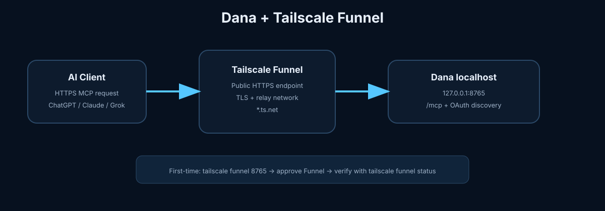
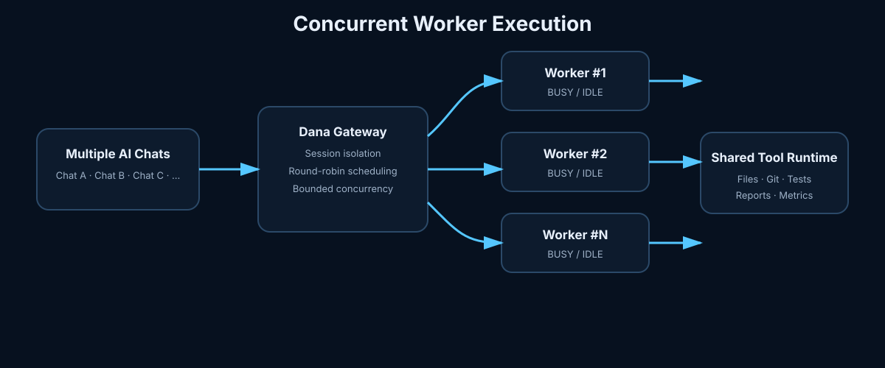
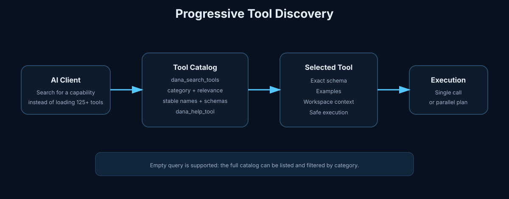
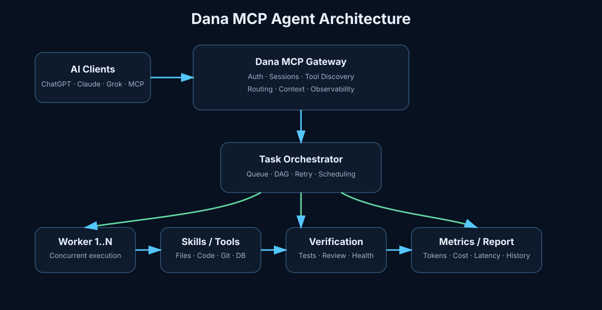

# Dana MCP Server

> Turn AI chatbots into powerful, free agents that can work with your computer, code, files, projects, and development environment through MCP.

🇮🇷 **Persian documentation:** [README_FA.md](README_FA.md)  
🇬🇧 **English:** This document

---

## 🙏 Special Thanks

Special thanks to **Mohsen Samadinejad**. The original execution idea and early architectural direction that inspired this project came from his work.

His **PHP MCP Server** was an important behavioral reference during Dana's Python implementation and evolution.

GitHub: [Mohsen Samadinejad](https://github.com/samadinejad)

---

## What is Dana?

Dana is a cross-platform Python MCP server that gives compatible AI chatbots real capabilities on the machine where Dana runs.

Instead of being limited to conversation, a chatbot can become an agent that can:

- read, create, edit, and organize files
- inspect and modify codebases
- run tests, builds, linters, and diagnostics
- manage Git, processes, packages, Docker, databases, and APIs
- automate browsers
- analyze projects and architecture
- work with persistent project memory and optimized context
- extract and analyze PDF content
- generate documents, reports, README files, Word files, and PDFs
- plan, review, debug, and validate engineering work

Dana is designed to work with MCP-compatible AI clients such as ChatGPT, Claude, Grok, and other compatible clients. The core project is free and self-hosted: Dana runs on your own computer or server and performs work there.

## Why Dana?

Dana is built around three goals:

1. **Real agent capabilities** — the chatbot can act through tools instead of only generating text.
2. **Self-hosting and control** — tools run on infrastructure you control.
3. **Efficiency** — Progressive Tool Discovery, caching, compact results, batching, and context intelligence reduce unnecessary latency and token usage.

---


# Installation and Connection

## Step 1 — Graphical setup (recommended)

Dana now includes a graphical setup flow. The GUI handles the complete Local Mode network sequence:

1. Detect Tailscale.
2. Install Tailscale when it is missing.
3. Open the Tailscale authentication flow.
4. Wait for the device to become connected.
5. Start Dana.
6. Enable Tailscale Funnel.
7. Open the Funnel approval flow when Tailscale requires it.
8. Verify the public Funnel hostname.
9. Verify Dana's `/mcp` endpoint.
10. Keep the local runtime and Funnel state monitored.

Launch it with:

```bash
python3 -m pip install -e .
dana gui
```

`dana gui` launches the Tauri desktop application when a local development/release build is available. Installed Dana Desktop packages launch the same Tauri application directly.

Packaged GUI installers are produced by the release pipeline for Windows, Linux, and macOS. The packaged Tauri application contains a Python setup agent as a bundled runtime component. The GUI never exposes its control API publicly; setup control is bound to localhost.



Tailscale Funnel is disabled by default and requires MagicDNS, HTTPS certificates, and the appropriate Funnel permission in the tailnet. Dana detects the resulting approval requirement and opens the browser instead of treating it as a generic installation failure. Tailscale's current CLI supports `tailscale funnel --https=<port> --bg` and `tailscale funnel status --json`. citeturn2search0turn0search6

### What the GUI automates

**Windows**
- Downloads and launches the current official Tailscale installer with elevation.
- Opens Tailscale authentication in the browser.
- Enables and verifies Funnel.
- Starts Dana automatically.

**Linux**
- Uses the official Tailscale installation script through the graphical `pkexec` elevation flow.
- Starts/uses the Tailscale daemon.
- Opens authentication/approval pages when required.
- Starts Dana and Funnel automatically.

**macOS**
- Opens the current official standalone Tailscale installer.
- Uses the Tailscale GUI authentication flow.
- Handles Funnel configuration after the device is connected.
- Reports system-extension approval when macOS requires it.

Tailscale recommends its standalone macOS package and documents explicit system-extension approval requirements on current macOS versions. citeturn2search0turn2search1turn2search7

### CLI fallback

The terminal workflow remains available for advanced users:

```bash
tailscale status
tailscale funnel --https=443 --bg 8765
tailscale funnel status
```

Tailscale documents `--bg` as the persistent mode; a background Funnel resumes after Tailscale restarts. citeturn0search0

**Security:** Funnel publishes the selected local service to the public internet. Dana keeps authentication enabled and uses the canonical `/mcp` resource; do not share authenticated connection material. citeturn0search6

---

## Step 2 — Get the project and start with Docker (recommended)

For the simplest runtime, Docker is the preferred deployment layer. You do not need to create a Python virtual environment manually, but the Dana Python package must be installed once so the CLI can prepare the runtime.

Clone the repository first:

```bash
git clone https://github.com/seyed-ali-002/Dana-MCP-Server.git
cd Dana-MCP-Server
```

After installing Docker Desktop (Windows/macOS) or Docker Engine + Compose v2 (Linux), install Dana's Python package once so the CLI is available:

```bash
python3 -m pip install -e .
```

On Windows:

```powershell
py -3 -m pip install -e .
```

Then run the complete Docker flow:

```bash
dana run
```

`dana run` performs the full startup flow: prepares configuration, builds/starts Dana, configures Tailscale Funnel, and prints the canonical `/mcp` endpoint. `dana up` and `dana start-all` are aliases for the same full flow.

For a fresh checkout, the package-install step above is the only Python bootstrap required; Dana creates its runtime environment/configuration as part of the CLI flow.


For lower-level Docker operations:

```bash
dana install
dana connect
```

`dana install` builds/starts the Docker runtime and also configures the Local Mode Funnel. `dana connect` is useful when the runtime is already installed and you only need to (re)configure the public endpoint.

Daily operations:

```bash
dana start
dana stop
dana restart
dana status
dana logs
dana update
dana uninstall
```

Use `dana uninstall --purge` only when you also want to remove the Docker-managed Dana runtime volume.

The container intentionally binds port `8765` to `127.0.0.1` only. Tailscale Funnel or a reverse proxy remains the public boundary. The project directory is mounted as `/workspace`, while runtime databases/log state are stored in a dedicated Docker volume. This Docker runtime does not provide unrestricted access to the entire host OS; host-level operations require Native Mode or a separately designed, controlled Host Bridge.

Docker is the runtime layer; users do not need to interact with Docker Compose directly.

### Native fallback

If Docker is unavailable, `dana install` automatically opens Dana's existing native installer. This keeps the project usable on systems where Docker cannot be installed.

---

## Step 3 — Native installation (without Docker)

If Docker is unavailable, use the existing native installer:

### Linux / macOS

```bash
python3 install.py
```

### Windows

```powershell
py -3 install.py
```

The Windows `run.bat` launcher also resolves the Python runtime safely when the project path or Windows username contains spaces.

The interactive installer:

- creates or updates an isolated `.venv`
- installs required dependencies
- lets you choose Local or Server Mode
- configures worker count
- creates persistent authentication configuration
- configures networking for the selected deployment mode
- checks required services before startup

For native deployment, the interactive Installer is the recommended first-time setup path.

---

## Step 4 — Choose a Deployment Mode

### Local Mode — personal computer

Local Mode is the simplest setup for a development machine or personal computer:

```text
AI Client
   │
   │ MCP over HTTPS
   ▼
Tailscale Funnel
   │
   ▼
Dana
   │
   ├── Files
   ├── Code
   ├── Shell
   ├── Git
   ├── Browser
   └── Intelligence
```

Dana exposes the canonical MCP endpoint:

```text
https://<machine>.<tailnet>.ts.net/mcp
```

Dana no longer puts the long-lived authentication token in the connection URL. Compatible clients authenticate through OAuth 2.0 + PKCE.

### Server Mode — VPS or dedicated server

Server Mode is designed for Linux servers and existing web infrastructure. Dana runs on an internal localhost port and integrates with an existing reverse proxy.

Supported reverse proxies:

- Nginx
- Caddy
- Apache

Architecture:

```text
Internet
   │
   ▼
https://mcp.example.com
   │
   ▼
Reverse Proxy :443
   │
   └── /mcp → 127.0.0.1:<DANA_PORT>
                    │
                    ▼
                  Dana
```

The Installer can detect existing proxies, back up configuration, validate changes, and avoid unnecessary service installation. If no supported proxy is available, it asks before installing Caddy.

Typical endpoint:

```text
https://mcp.example.com/mcp
```

Dana also exposes OAuth authorization metadata and a PKCE-based authorization-code flow for compatible reconnect flows, independently from My_PC or another local connector.

### Connection-link security

The generated ChatGPT connection URL is the canonical `/mcp` endpoint and **never contains Dana's long-lived bearer token**. Dana authenticates compatible clients through **OAuth 2.0 Authorization Code + PKCE**. The authorization code is single-use and short-lived, and the PKCE verifier is retained by the initiating client, so copying an authorization URL alone does not transfer an authenticated MCP session to another device.

The older `/<token>/mcp` URL remains only as a compatibility endpoint for existing local installations; it is not exposed by the generated connector link or OAuth resource metadata.

Opening the generated `/mcp` URL directly on another device does not authenticate that device: it receives the OAuth challenge and must complete its own authorized client flow. A server cannot cryptographically prove that two separate ChatGPT sessions are the same physical device; device-level identity must be supplied by the client/platform.

---

## Step 5 — Start and Stop Dana

After installation, use the project runners provided by your installation.

Typical local commands:

```bash
./run
./stop
```

On Windows, use the corresponding `.bat` runner.

In Server Mode, Dana can run as a systemd service:

```bash
sudo systemctl start dana
sudo systemctl stop dana
sudo systemctl restart dana
sudo systemctl status dana --no-pager
sudo journalctl -u dana -f
```

Worker count is configured during installation and stored as:

```env
DANA_WORKERS=5
```

---

## Step 6 — Connect Your AI Client

Add Dana as an MCP / Custom Connector and use the exact URL generated by Dana.

### ChatGPT — Developer Mode first

ChatGPT's current custom MCP app flow requires **Developer Mode** for the relevant accounts/workspaces. OpenAI documents the current path as Apps / Advanced Settings or Workspace Settings → Apps → Create, depending on plan and permissions. The full MCP feature set is still being rolled out and UI/permissions can change. citeturn0search0

**Step 1 — Enable Developer Mode**

Open **Settings → Security** and enable **Developer Mode** when your account exposes that option. The exact location can vary by plan/workspace; OpenAI currently documents **Settings → Apps → Advanced Settings** for some accounts and workspace-specific paths for others. citeturn0search0


**Step 2 — Create the Dana MCP App**

Open **Apps → Create** (or the corresponding Workspace Apps → Create area for an admin).

**Step 3 — Enter Dana's MCP endpoint**

Enter Dana's MCP endpoint and choose the required authentication method.


**Step 4 — Scan Tools and authorize**

Click **Scan Tools**, complete authorization if prompted, then create the app.


**Step 5 — Use Dana in a chat**

In a chat, select the Dana app/connector for the message and verify that its tools are available.


OpenAI's current documentation notes that exact availability depends on plan/workspace permissions; custom apps are web-only, and full MCP write/modify support is rolling out. citeturn0search0

### Installing the plugin / app

Some ChatGPT interfaces expose an **Install plugin** action, while newer interfaces use **Apps** and custom MCP apps. If **Install plugin** is shown, the general flow is: open Apps/Plugins → Install plugin → Connect/authorize → enable it for the conversation. citeturn0search14

**Step 1 — Open Apps / Plugins**

Open the client's Apps / Plugins area.


**Step 2 — Install the plugin/app**

Choose **Install plugin** (or the equivalent Apps action).

**Step 3 — Connect and authorize**

Enter or select Dana, then complete the connection/authorization flow.

**Step 4 — Enable for the conversation**

Enable the installed Dana app/plugin for the current conversation.

For a custom Dana MCP server, prefer the current **Create custom app** flow above when Developer Mode is available.

### Claude — no Developer Mode step

Claude supports custom remote MCP connectors without the ChatGPT-style Developer Mode step. For individual Pro/Max users, the current flow is **Customize → Connectors → + → Add custom connector**, enter Dana's public MCP URL, then **Add** and **Connect**. Team/Enterprise owners may need to add the connector at the organization level first. citeturn2search0turn2search4


1. Open **Customize → Connectors**.
2. Select **Add custom connector**.
3. Enter the Dana connector name and public MCP URL.
4. Add it and complete authentication if requested.
5. In a chat, use **+ → Connectors** and enable Dana.

Claude connects to remote custom connectors from Anthropic's cloud, so Dana must be reachable from the public internet. citeturn2search0

### Grok — no Developer Mode step

Grok currently supports custom MCP connectors directly from **grok.com/connectors**: **New Connector → Custom → enter the MCP server URL → complete authentication**. citeturn1search0


1. Open **grok.com/connectors**.
2. Click **New Connector**.
3. Select **Custom** and enter Dana's public MCP URL.
4. Complete authentication if required.
5. Confirm that Dana's tools are discovered and available in the conversation.

Grok's current documentation requires a publicly reachable MCP server for custom web connectors. Dana's Tailscale Funnel setup provides that public HTTPS endpoint in Local Mode. citeturn1search0turn1search1

> Client menu names and availability can change over time. Follow the current client UI when it differs from these diagrams.

---

# Security and Access Control

Dana executes tools on the machine where it is running. Operating-system permissions therefore matter.

Filesystem access can be restricted in `config/access_policy.json`:

```json
{
  "allowed_paths": ["/home/user/projects", "/mnt/workspace"],
  "deny_paths": []
}
```

Dana also provides MCP tools for inspecting and updating the access policy.

Keep connection URLs and tokens private. Rotate a token when necessary:

```bash
python scripts/regenerate_token.py
```

---

# Concurrent Workers and Agent Orchestration



Dana supports multiple AI clients and concurrent tool execution in the same MCP service. Worker slots are bounded by `DANA_WORKERS`, while MCP sessions remain in the stateful transport process so session state is not lost by creating a separate HTTP server for every worker.

Each request is assigned to a worker slot, and independent work can run concurrently. The runtime also supports dependency-aware plans through `dana_plan_execute`: independent tasks can execute in parallel while dependent tasks wait for their prerequisites.

Useful runtime tools include:

- `dana_worker_status` — live worker capacity and active/idle slots
- `dana_parallel_call` — concurrent execution of independent tool calls
- `dana_plan_execute` — dependency-aware task DAG execution
- `dana_runtime_health` — registry and orchestration health checks
- `dana_workspace_context` — compact project/workspace context

This architecture is intended for multiple simultaneous chats without serializing all tool calls behind Worker #1.

# Performance and Context Optimization

Dana is intentionally designed to avoid turning a large tool registry into unnecessary prompt overhead.

## Progressive Tool Discovery



By default, the MCP client sees a small set of entry points:

- `dana_search_tools`
- `dana_list_tools`
- `dana_help_tool`
- `dana_call_tool`
- `dana_batch_call`
- `dana_capabilities`
- `dana_worker_status`
- `dana_runtime_health`
- `dana_optimization_stats`

The complete registry remains available internally and is discovered on demand. This keeps initial MCP context small even when Dana contains many capabilities.

## Runtime Optimization

Dana includes:

- short-lived caching for safe read operations
- parallel execution for independent batch calls
- compact result generation
- context deduplication and compression
- repository and symbol indexing
- delta context and file summaries
- persistent codebase memory
- bounded analysis to avoid oversized responses
- tool cost and optimization statistics

Legacy clients that require the full tool list can disable progressive discovery:

```env
DANA_PROGRESSIVE_TOOLS=0
```

To disable safe-read caching:

```env
DANA_TOOL_CACHE=0
```

---

# All Dana Capabilities

Dana's complete registry is organized below. In the default optimized MCP mode, these capabilities are discovered and invoked through `dana_search_tools` and `dana_call_tool` rather than all being sent to the client at connection time.

## Core MCP and Optimization

- `dana_search_tools`
- `dana_call_tool`
- `dana_batch_call`
- `dana_capabilities`
- `dana_optimization_stats`
- `dana_optimization_controller`
- `dana_tool_cost`
- `dana_tool_costs`
- `dana_fast_path`
- `dana_prompt_cache_key`
- `dana_semantic_cache`
- `dana_result_optimize`
- `dana_result_page`
- `dana_result_delta`
- `dana_context_build`
- `dana_context_compact`

## Filesystem and Workspace

- `list_directory`
- `read_file`
- `write_file`
- `edit_file`
- `delete_path`
- `workspace_snapshot`
- `change_summary`
- `rollback_changes`
- `get_allowed_paths`
- `set_allowed_paths_tool`
- `add_allowed_path_tool`
- `remove_allowed_path_tool`
- `validate_path_access`

## Shell, Processes, System, and Network

- `run_command`
- `run_process`
- `debug_command`
- `debug_trace`
- `process_list`
- `process_stop`
- `system_info`
- `system_details`
- `system_metrics`
- `environment`
- `network_check`
- `port_check`
- `schedule_command`
- `cancel_scheduled_task`

## Code Search and Project Analysis

- `search_code`
- `find_symbol`
- `find_references`
- `find_entry_points`
- `analyze_project`
- `architecture_summary`
- `generate_project_diagram`
- `project_health_check`
- `code_complexity`
- `find_duplicate_code`
- `static_analysis`
- `python_diagnostics`
- `change_summary`
- `analyze_stacktrace`
- `analyze_implementation_need`
- `review_implementation`
- `simplify_code`

## Build, Test, Quality, and Debugging

- `run_tests`
- `build_project`
- `discover_tests`
- `coverage`
- `benchmark`
- `check_code_quality`
- `check_prettier`
- `lint_or_format`
- `format_code`
- `format_project`
- `format_python`
- `format_python_check`
- `lint_python`
- `fix_python_code`
- `sort_python_imports`
- `type_check_python`
- `lint_javascript`
- `dana_debug_issue`
- `dana_test_intelligence`
- `dana_predict_regression`
- `dana_rank_root_causes`
- `dana_self_healing_plan`

## Git, Packages, Containers, and Dependencies

- `git`
- `package_manager`
- `dependency_outdated`
- `dependency_security_scan`
- `secret_scan`
- `docker`
- `docker_status`
- `docker_build`
- `container_logs`
- `toolchain_status`

## HTTP, APIs, Browser, and Web

- `http_request`
- `api_request`
- `web_fetch`
- `browser_check`
- `browser_open`
- `browser_automation`
- `dana_api_intelligence`

Optional browser support can be installed with:

```bash
pip install -e ".[browser]"
playwright install chromium
```

## Database Intelligence

- `sqlite_query`
- `database_schema`
- `database_health_check`
- `dana_database_intelligence`

## PDF, Documents, Reports, and Documentation

- `extract_pdf_text`
- `extract_pdfs_text`
- `create_document`
- `create_docx`
- `create_pdf`
- `generate_readme`
- `generate_changelog`
- `generate_report`

## Codebase Memory and Context

- `index_codebase`
- `update_codebase_memory`
- `clear_codebase_memory`
- `codebase_memory_status`
- `search_codebase_memory`
- `get_context`
- `get_context_delta`
- `get_file_delta`
- `get_file_summary`
- `get_project_map`
- `get_symbol_context`
- `get_dependency_context`
- `estimate_tokens_for_context`
- `context_compress`
- `memory_write`
- `memory_retrieve`
- `memory_stats`
- `memory_digest`
- `memory_export`
- `memory_feedback`
- `memory_link`
- `memory_links`
- `memory_maintain`
- `memory_purge`

## Library and Documentation Intelligence

- `resolve_library`
- `get_library_docs`
- `search_library_docs`

## Advanced Engineering Intelligence

- `dana_classify_request`
- `dana_route_request`
- `dana_plan`
- `dana_plan_execute`
- `dana_create_implementation_plan`
- `dana_engineering_decision`
- `dana_engineering_policy`
- `dana_architecture_review`
- `dana_dependency_graph`
- `dana_analyze_change_impact`
- `dana_project_index`
- `dana_map_repository`
- `dana_symbol_search`
- `dana_trace_symbol`
- `dana_security_review`
- `dana_execution_sandbox_plan`
- `dana_cross_repository_intelligence`
- `dana_record_architecture_decision`
- `dana_visual_architecture_graph`

## Tasks, Planning, and Work Sessions

- `create_task_plan`
- `task_status`
- `start_work_session`
- `end_work_session`
- `dana_session_start`
- `dana_session_get`
- `dana_plan_execute`
- `dana_parallel_call`
- `dana_workspace_context`
- `dana_worker_status`
- `dana_runtime_health`

## Tool Discovery and Runtime Orchestration

- `dana_list_tools`
- `dana_search_tools`
- `dana_help_tool`
- `dana_capabilities`
- `dana_parallel_call`
- `dana_plan_execute`
- `dana_workspace_context`
- `dana_worker_status`
- `dana_runtime_health`

## Token and Operation Analytics

- `record_token_usage`
- `get_token_analytics`
- `reset_token_analytics`
- `get_operation_analytics`

## UI and Visual Design Intelligence

- `dana_create_ui_design`
- `dana_add_ui_screen`
- `dana_add_ui_component`
- `dana_connect_ui_screens`
- `dana_generate_ui_prompt`
- `dana_export_ui_html`

---

# Example Requests

After connecting Dana, you can ask your AI client things like:

- “Analyze this repository and explain the architecture.”
- “Find the cause of this stack trace and propose the smallest safe fix.”
- “Read all PDFs in this folder, extract their content, and build a study guide.”
- “Review my changes, predict regression risks, run targeted tests, and report the result.”
- “Create an implementation plan before changing the code.”
- “Search the project for duplicate code and simplify it safely.”
- “Create a Persian Word or PDF report from these project files.”
- “Inspect the database schema and identify likely performance risks.”

---

## Dana Doctor

Dana includes a cross-platform diagnostic command for cases where one machine works correctly and another does not.

    python -m dana doctor

or:

    dana doctor

Doctor checks the Dana version and Git commit, Python compatibility, environment configuration, required project files, dependencies, live health and OAuth routes, Tailscale state, Funnel state, deployment mode, and the generated connector URL. Tokens are masked by default.

    python -m dana doctor --show-url

Use `--show-url` only on a trusted terminal when you need the complete Local Mode URL. Machine-readable output is also available:

    python -m dana doctor --json

---

# Usage Report and Observability

Dana generates a local `report.html` containing token estimates/provider-reported usage, operation counts, worker activity, failures, and actual tool execution time. **Active usage time** sums the measured execution duration of operations; idle time between separate chats is not counted as usage.

Runtime databases, reports, and local telemetry are kept out of Git.

# Testing

Run the test suite:

```bash
pytest -q
```

For a basic syntax check:

```bash
python3 -m py_compile dana/http.py
```

---

# Architecture



Dana keeps the MCP layer lightweight while heavier analysis is performed on demand:

```text
AI Client
   │
   ▼
Dana MCP Gateway
   │
   ├── Progressive Tool Discovery
   ├── Authentication / OAuth
   ├── Optimization Layer
   └── Tool Router
          │
          ├── System & Files
          ├── Engineering Intelligence
          ├── Codebase Memory
          ├── Browser & API
          ├── Documents & PDF
          └── Database & Containers
```

This design helps Dana grow without sending its entire capability set into every initial MCP request.

---

# Contributing

Dana is an open project and contributions are welcome.

You can help by:

1. reporting bugs
2. proposing new tools or integrations
3. improving installation and deployment support
4. adding tests
5. improving documentation
6. submitting pull requests
7. reviewing architecture and performance

Before opening a pull request, please test your changes and keep changes focused where possible.

When reporting a bug, include relevant information such as:

- operating system
- Python version
- Dana version or commit
- deployment mode
- relevant logs
- reproduction steps

If Dana is useful to you, consider starring the repository and sharing ideas for its next capabilities.

## License

See [LICENSE](LICENSE).
