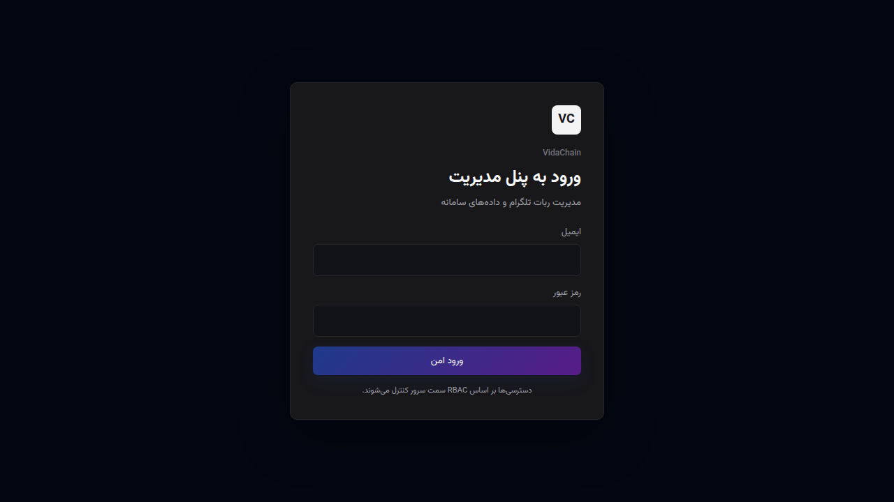

# Dana MCP Server

Turn AI chatbots into powerful agents that can work with your computer, code, files, and tools through MCP.

🇮🇷 **Persian:** [README_FA.md](README_FA.md) · 🇬🇧 **English:** this page

---

## What is Dana?

Dana is a self-hosted Python MCP server. Compatible clients (ChatGPT, Claude, Grok, and others) connect to it and can act on the machine where Dana runs — files, shell, Git, Docker, browsers, and more.

You keep control of the host. The core project is free and open source.

---

## 1. Desktop (recommended)

1. Download the latest build for Windows, Linux, or macOS from  
   [GitHub Releases](https://github.com/seyed-ali-002/Dana-MCP-Server/releases/latest).
2. Open **Dana** → **Setup**.
3. Click **Install & Activate** (or **Activate Dana** if Tailscale is already installed).

Dana will install/connect Tailscale when needed, ask the OS for admin rights if required (password is never stored), show login/Funnel links in the app, start the local MCP server, and enable Funnel after you confirm.

Desktop packages are rebuilt automatically on every successful push to `main`.




### Panels

| Panel | Purpose |
|---|---|
| **Setup** | Install Tailscale, sign in, start Dana, enable Funnel |
| **Control** | Start/stop, copy MCP URLs, token, advanced settings |
| **Logs** | Setup/errors · live tool activity |

### MCP URLs

Local:

```text
http://127.0.0.1:8765/<TOKEN>/mcp
```

Public (Funnel):

```text
https://<machine>.<tailnet>.ts.net/<TOKEN>/mcp
```

Treat tokenized URLs as secrets. Use **Test connection** in Control to verify.

### Admin rights

- **Windows** — UAC prompt
- **Linux** — polkit (`pkexec`) or `sudo`
- **macOS** — system password dialog

If download fails (for example HTTP 403), open the manual Tailscale download page, install, then **Continue after install**.

---

## 2. Terminal / CLI

Use this path on servers, headless hosts, or when you prefer the shell.

### Install the package

```bash
git clone https://github.com/seyed-ali-002/Dana-MCP-Server.git
cd Dana-MCP-Server
python3 -m pip install -e .
```

Windows:

```powershell
py -3 -m pip install -e .
```

### One-shot setup and run

```bash
dana run
```

`dana run` (aliases: `dana up`, `dana start-all`) prepares config, starts the runtime, configures Tailscale Funnel when possible, and prints the endpoint.

When Docker is available, `dana run` / `dana install` / `dana connect` prefer Docker and fall back to the native runtime otherwise. Day-to-day lifecycle commands prefer the native runtime after install. Force Docker with:

```bash
export DANA_RUNTIME_BACKEND=docker
```

### Everyday commands

```bash
dana start
dana stop
dana restart
dana status
dana logs
dana update
dana uninstall
dana gui          # open Control Center when available
```

Step-by-step Docker flow:

```bash
dana install      # build/start runtime + local Funnel setup
dana connect      # refresh public endpoint when runtime already exists
```

### Native installer (no Docker)

Linux / macOS:

```bash
python3 install.py
```

Windows:

```powershell
py -3 install.py
```

The installer creates/updates a virtualenv, installs dependencies, chooses Local or Server mode, workers, and authentication.

### Run the server only

```bash
python3 -m dana.main
# or
dana run
```

Default listen address: `127.0.0.1:8765`.

### Tailscale Funnel (CLI)

```bash
tailscale status
tailscale funnel --https=443 --yes --bg 8765
tailscale funnel status
```

Show the full tokenized URL in a trusted terminal:

```bash
dana doctor --show-url
```

---

## 3. Deployment modes

### Local Mode

Personal machine. Dana listens on localhost; Tailscale Funnel provides HTTPS:

```text
AI client → Tailscale Funnel → Dana → your computer
```

### Server Mode

VPS / dedicated host behind Nginx, Caddy, or Apache:

```text
Internet → reverse proxy → 127.0.0.1:<port> → Dana
```

Server Mode typically uses the canonical `/mcp` path with OAuth 2.0 + PKCE. Local Mode commonly uses the tokenized URL.

---

## 4. Connect a client

1. Finish Desktop Setup or CLI `dana run` until you have a working URL.
2. Copy the tokenized MCP URL (Desktop **Control**, or CLI/`dana doctor --show-url`).
3. Add it as a custom MCP / connector in ChatGPT, Claude, Grok, or another compatible client.

Do not publish tokenized URLs in screenshots, issues, or public logs.

---

## 5. Security

- OS permissions apply to everything Dana can do on the host.
- Restrict filesystem scope in `config/access_policy.json` or via MCP policy tools.
- Rotate the token when needed (Desktop **Control**, or `python3 scripts/regenerate_token.py`).
- Funnel publishes an HTTPS endpoint for your machine — enable it only when intentional.
- Closing the desktop app stops the Dana runtime; Funnel routes are left unchanged on purpose.

---

## 6. Architecture notes

- **Progressive tool discovery** keeps the initial MCP tool list small; full capabilities are found via `dana_search_tools` / `dana_call_tool`.
- Multiple workers (`DANA_WORKERS`) support concurrent clients.
- Details: [project_description_md/](project_description_md/).


---

## Thanks

Special thanks to [Mohsen Samadinejad](https://github.com/samadinejad) for early architectural inspiration.

---

## License

See the repository license file.
