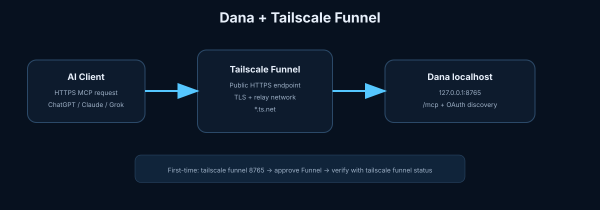
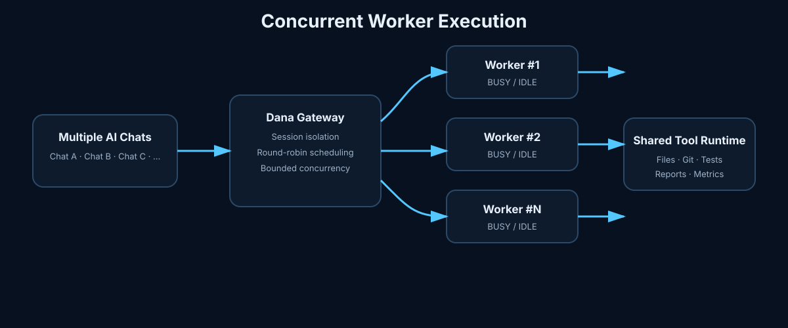
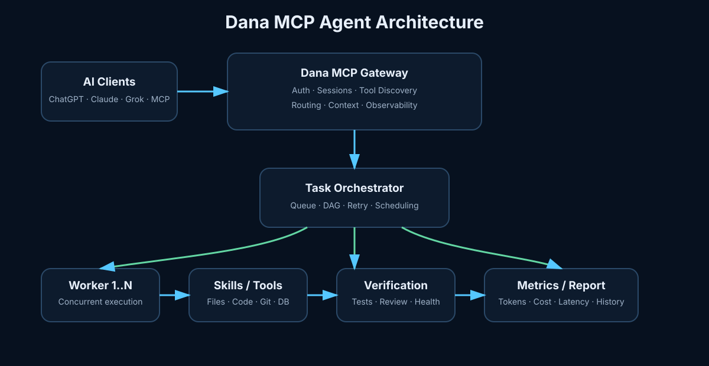
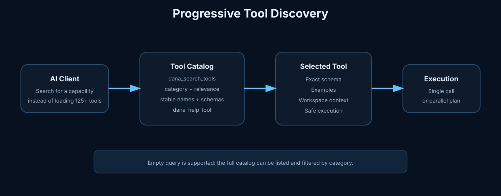

# دانا MCP Server

> دانا یک MCP Server متن‌باز است که می‌تواند چت‌بات‌های هوش مصنوعی را به Agentهای رایگان و قدرتمند با دسترسی واقعی به کامپیوتر، فایل‌ها، کد و محیط توسعه شما تبدیل کند.

🇬🇧 **English documentation (main):** [README.md](README.md)

---

## 🙏 تشکر ویژه

تشکر ویژه از **محسن صمدی‌نژاد (Mohsen Samadinejad)** که ایده اجرایی و مسیر اولیه‌ای که الهام‌بخش این پروژه بود از کار ایشان شکل گرفت.

پیاده‌سازی **PHP MCP Server** ایشان یکی از مراجع رفتاری مهم در مسیر توسعه نسخه Python دانا بوده است.

GitHub: [Mohsen Samadinejad](https://github.com/samadinejad)

---

## دانا چیست؟

دانا روی سیستم یا سرور شما اجرا می‌شود و از طریق MCP به ChatGPT، Claude، Grok و سایر Clientهای سازگار قابلیت‌های واقعی می‌دهد؛ بنابراین چت‌بات فقط پاسخ متنی تولید نمی‌کند و می‌تواند کارهای واقعی انجام دهد.

برای نمونه:

- فایل و پوشه ایجاد، خوانده و ویرایش کند
- پروژه و کد را تحلیل کند
- تست، Build و Lint اجرا کند
- Git، Process، Package، Docker و Database را مدیریت کند
- Browser Automation انجام دهد
- PDFها را استخراج و تحلیل کند
- Word، PDF، Report و Documentation بسازد
- معماری، تغییرات و ریسک Regression را بررسی کند
- Context و Memory پروژه را مدیریت کند

دانا Self-hosted است و هسته اصلی آن رایگان و متن‌باز است؛ ابزارها روی زیرساختی که خودتان انتخاب می‌کنید اجرا می‌شوند.

---

# مراحل نصب و اتصال

## مرحله ۱ — نصب، ورود و فعال‌سازی Tailscale Funnel

برای ساده‌ترین حالت Local Mode ابتدا [Tailscale](https://tailscale.com/) را روی سیستمی که دانا اجرا می‌شود نصب و Login کنید. دانا برای ایجاد Endpoint عمومی HTTPS در Local Mode از Tailscale Funnel استفاده می‌کند.



**نکته مهم:** فقط Login کردن به Tailscale کافی نیست. Funnel نیز باید فعال و تأیید شود. پورت پیش‌فرض Backend دانا `8765` است؛ بنابراین بعد از اتصال Tailscale دستور `tailscale funnel 8765` را اجرا کنید و اگر صفحه تأیید Funnel نمایش داده شد آن را تأیید کنید. citeturn2search1

### Linux

[دانلود Tailscale برای Linux](https://tailscale.com/download/linux)

سپس:

```bash
sudo systemctl enable --now tailscaled
sudo tailscale up
tailscale status
```

بعد از اتصال، Funnel دانا را فعال کنید:

```bash
tailscale funnel 8765
```

در اولین اجرا ممکن است Tailscale صفحه تأیید/فعال‌سازی Funnel را باز کند. **فعال‌سازی Funnel را تأیید کنید.** سپس برای اجرای دائمی در پس‌زمینه:

```bash
tailscale funnel --bg 8765
tailscale funnel status
```

باید در خروجی `tailscale funnel status` یک Route فعال برای دانا مشاهده شود. گزینه `--bg` باعث می‌شود Funnel بعد از پایان ترمینال نیز به کار ادامه دهد. citeturn2search0turn2search5

**امنیت:** Funnel سرویس انتخاب‌شده را روی اینترنت عمومی قابل دسترس می‌کند. احراز هویت دانا را فعال نگه دارید، URL شامل Token را عمومی نکنید و سرویس‌های حساس را از طریق Funnel منتشر نکنید. citeturn1search3turn0search12

### Windows

[دانلود Tailscale برای Windows](https://tailscale.com/download/windows)

برنامه را نصب کنید، روی **Log in** بزنید و پس از ورود مطمئن شوید وضعیت **Connected** است.

سپس در ترمینال Administrator این دستور را اجرا کنید:

```powershell
tailscale funnel 8765
```

اگر صفحه تأیید Funnel نمایش داده شد آن را تأیید کنید و سپس وضعیت را بررسی کنید:

```powershell
tailscale funnel status
```

### macOS

[دانلود Tailscale برای macOS](https://tailscale.com/download/mac)

برنامه را نصب و Login کنید و وضعیت اتصال را بررسی کنید.

سپس:

```bash
tailscale funnel 8765
tailscale funnel status
```

در اولین فعال‌سازی، تأیید Funnel را انجام دهید. در macOS محدودیت‌های نسخه/نوع نصب Tailscale را در مستندات فعلی بررسی کنید. citeturn2search1

> حساب Tailscale باید اجازه استفاده از Funnel را داشته باشد.

---

## مرحله ۲ — دریافت پروژه

```bash
git clone https://github.com/seyed-ali-002/Dana-MCP-Server.git
cd Dana-MCP-Server
```

## مرحله ۳ — اجرای Installer

### Linux / macOS

```bash
python3 install.py
```

### Windows

```bat
python install.py
```

Installer به‌صورت تعاملی:

- `.venv` ایزوله می‌سازد یا به‌روزرسانی می‌کند
- وابستگی‌ها را نصب می‌کند
- Local یا Server Mode را انتخاب می‌کند
- تعداد Workerها را تنظیم می‌کند
- تنظیمات احراز هویت را ایجاد می‌کند
- شبکه و سرویس‌های موردنیاز Mode انتخاب‌شده را تنظیم می‌کند

---

## مرحله ۴ — انتخاب حالت اجرا

### Local Mode

برای کامپیوتر شخصی یا سیستم توسعه:

```text
AI Client
   │
   ▼
Tailscale Funnel
   │
   ▼
Dana
   ├── Files
   ├── Code
   ├── Shell
   ├── Git
   ├── Browser
   └── Intelligence
```

لینک اتصال معمولاً مشابه این است:

```text
https://<machine>.<tailnet>.ts.net/<TOKEN>/mcp
```

همان لینکی که Dashboard دانا نمایش می‌دهد را در MCP Connector وارد کنید.

### Server Mode

برای VPS و سرور Linux طراحی شده است. Dana روی یک پورت داخلی `localhost` اجرا می‌شود و Reverse Proxy مسیر `/mcp` را به آن متصل می‌کند.

Reverse Proxyهای پشتیبانی‌شده:

- Nginx
- Caddy
- Apache

Endpoint نمونه:

```text
https://mcp.example.com/mcp
```

Installer می‌تواند Proxy موجود را شناسایی کند، قبل از تغییر Backup بگیرد، تنظیمات را Validate کند و در صورت خطا Rollback انجام دهد.

جریان OAuth و PKCE برای Reconnect Clientهای سازگار نیز مستقل از My_PC توسط خود Dana ارائه می‌شود.

---

## مرحله ۵ — اجرا و توقف

پس از نصب، معمولاً:

```bash
./run
./stop
```

در Server Mode:

```bash
sudo systemctl start dana
sudo systemctl stop dana
sudo systemctl restart dana
sudo systemctl status dana --no-pager
sudo journalctl -u dana -f
```

تعداد Workerها هنگام نصب تنظیم می‌شود:

```env
DANA_WORKERS=5
```

---

## مرحله ۶ — اتصال ChatGPT، Claude یا Grok

در بخش MCP / Custom Connector سرویس موردنظر، URL تولیدشده توسط Dana را وارد کنید.

- **ChatGPT:** اتصال MCP یا Connector
- **Claude:** Custom MCP Connection
- **Grok:** Custom Connector

نام دقیق منوها ممکن است با تغییر رابط کاربری سرویس‌ها متفاوت باشد.

---

# امنیت و دسترسی

دانا ابزارها را روی همان سیستمی اجرا می‌کند که روی آن نصب شده است؛ بنابراین سطح دسترسی سیستم‌عامل اهمیت دارد.

می‌توانید دسترسی فایل را محدود کنید:

```json
{
  "allowed_paths": ["/home/user/projects", "/mnt/workspace"],
  "deny_paths": []
}
```

فایل تنظیمات:

```text
config/access_policy.json
```

برای تولید Token جدید:

```bash
python scripts/regenerate_token.py
```

---

# اجرای همزمان Workerها و Orchestration



دانا می‌تواند همزمان به چند Chat Bot یا چند Session متصل باشد. تعداد Workerها با `DANA_WORKERS` مشخص می‌شود و هر درخواست می‌تواند روی یک Worker مستقل اجرا شود؛ در نتیجه چند درخواست همزمان پشت سر هم منتظر Worker شماره ۱ نمی‌مانند.

برای کارهای مستقل می‌توان از `dana_parallel_call` استفاده کرد و برای کارهایی که وابستگی دارند از `dana_plan_execute`. در Plan، taskهای مستقل موازی و taskهای وابسته بعد از تکمیل پیش‌نیازها اجرا می‌شوند.

ابزارهای اصلی این بخش:

- `dana_worker_status` — وضعیت لحظه‌ای Workerها و ظرفیت آزاد
- `dana_parallel_call` — اجرای همزمان ابزارهای مستقل
- `dana_plan_execute` — اجرای Plan/DAG با dependency
- `dana_runtime_health` — بررسی سلامت Runtime و Registry
- `dana_workspace_context` — ساخت Context فشرده از Workspace



# بهینه‌سازی سرعت و Token

دانا تمام ابزارها را در ابتدای اتصال به Client ارسال نمی‌کند. به‌صورت پیش‌فرض فقط چند Entry Point سبک نمایش داده می‌شود:



- `dana_search_tools`
- `dana_list_tools`
- `dana_help_tool`
- `dana_call_tool`
- `dana_batch_call`
- `dana_capabilities`
- `dana_worker_status`
- `dana_runtime_health`
- `dana_optimization_stats`

سپس Client فقط ابزار موردنیاز را کشف می‌کند.

دانا همچنین شامل:

- Cache عملیات Safe Read
- Batch Execution موازی
- Compact Result
- Context Deduplication
- Codebase Memory
- Delta Context
- Repository Index
- Symbol Analysis
- Bounded Analysis
- Tool Cost Statistics

است.

### کشف ابزار و Help

برای دریافت فهرست کامل و تمیز ابزارها:

```text
dana_list_tools
```

برای جستجو، حتی Query خالی پشتیبانی می‌شود:

```text
dana_search_tools(query="", category="filesystem")
```

برای دریافت Schema، توضیح و نمونه استفاده یک ابزار:

```text
dana_help_tool(name="edit_file")
```

این لایه باعث می‌شود نام ابزارها، دسته‌بندی، توضیحات و Schemaها ساختار یکنواخت‌تری داشته باشند و Client مجبور نباشد کل Registry را در Context اولیه بارگذاری کند.

برای نمایش Legacy Full Tool List:

```env
DANA_PROGRESSIVE_TOOLS=0
```

برای غیرفعال کردن Cache:

```env
DANA_TOOL_CACHE=0
```

---

# تمام قابلیت‌های Dana

نسخه اصلی و کامل فهرست ابزارها در [README انگلیسی](README.md#all-dana-capabilities) قرار دارد.

دسته‌بندی قابلیت‌ها:

- Core MCP و Optimization
- File و Workspace Management
- Shell، Process، System و Network
- Code Search و Project Analysis
- Test، Build، Quality و Debugging
- Git، Package، Docker و Dependency
- HTTP، API، Web و Browser Automation
- Database Intelligence
- PDF، Document، Report و Documentation
- Codebase Memory و Context
- Library Intelligence
- Advanced Engineering Intelligence
- Task Planning و Work Sessions
- Token و Operation Analytics
- UI و Visual Design Intelligence

مهم‌ترین قابلیت‌های پیشرفته شامل:

```text
Repository Intelligence
Architecture Review
Change Impact Analysis
Root Cause Ranking
Regression Prediction
Database Intelligence
API Intelligence
Security Review
Test Intelligence
Cross Repository Intelligence
Visual Architecture Graph
Architecture Decision Records
Execution Sandbox Planning
Bounded Self Healing
PDF Text Extraction
Codebase Memory
Context Optimization
```

تمام ابزارها همچنان از طریق `dana_search_tools` و `dana_call_tool` قابل کشف و اجرا هستند.

---

# نمونه درخواست‌ها

بعد از اتصال می‌توانید به Agent بگویید:

- «این پروژه را تحلیل کن و معماری‌اش را توضیح بده.»
- «علت این Stack Trace را پیدا کن و کم‌خطرترین Fix را پیشنهاد بده.»
- «تمام PDFهای این پوشه را بخوان و از محتوایشان یک راهنمای آموزشی بساز.»
- «تغییرات من را بررسی کن، ریسک Regression را پیش‌بینی کن و تست‌های لازم را اجرا کن.»
- «قبل از تغییر کد یک Implementation Plan کامل بساز.»
- «کدهای تکراری پروژه را پیدا و با کمترین تغییر اصلاح کن.»
- «از این پروژه یک گزارش Word یا PDF فارسی بساز.»
- «Schema دیتابیس را بررسی و ریسک‌های Performance را مشخص کن.»

---

# گزارش مصرف و Observability

دانا یک `report.html` محلی تولید می‌کند که شامل Tokenها، تعداد عملیات، Workerها، خطاها و زمان اجرای واقعی عملیات است. **Active Usage Time** فقط مدت اجرای واقعی Toolها را جمع می‌کند و فاصله‌های بیکاری بین دو Chat را به زمان مصرف‌شده اضافه نمی‌کند.

اطلاعات Runtime و گزارش محلی در Git commit نمی‌شوند.

# تست

```bash
pytest -q
```

بررسی Syntax:

```bash
python3 -m py_compile dana/http.py
```

---

# مشارکت در توسعه

دانا یک پروژه باز است و از مشارکت استقبال می‌کند.

می‌توانید با موارد زیر کمک کنید:

1. گزارش Bug
2. پیشنهاد قابلیت جدید
3. توسعه ابزارهای جدید
4. بهبود Installer و Deployment
5. افزودن Test
6. بهبود Documentation
7. ارسال Pull Request
8. بررسی Architecture و Performance

هنگام گزارش مشکل، تا حد امکان این موارد را اضافه کنید:

- سیستم‌عامل
- نسخه Python
- نسخه یا Commit دانا
- Local یا Server Mode
- Log مرتبط
- مراحل بازتولید مشکل

اگر Dana برای شما مفید است، با Star کردن Repository، ارسال Issue و Pull Request و پیشنهاد ایده‌های جدید در توسعه آن مشارکت کنید.

## License

فایل [LICENSE](LICENSE) را ببینید.
